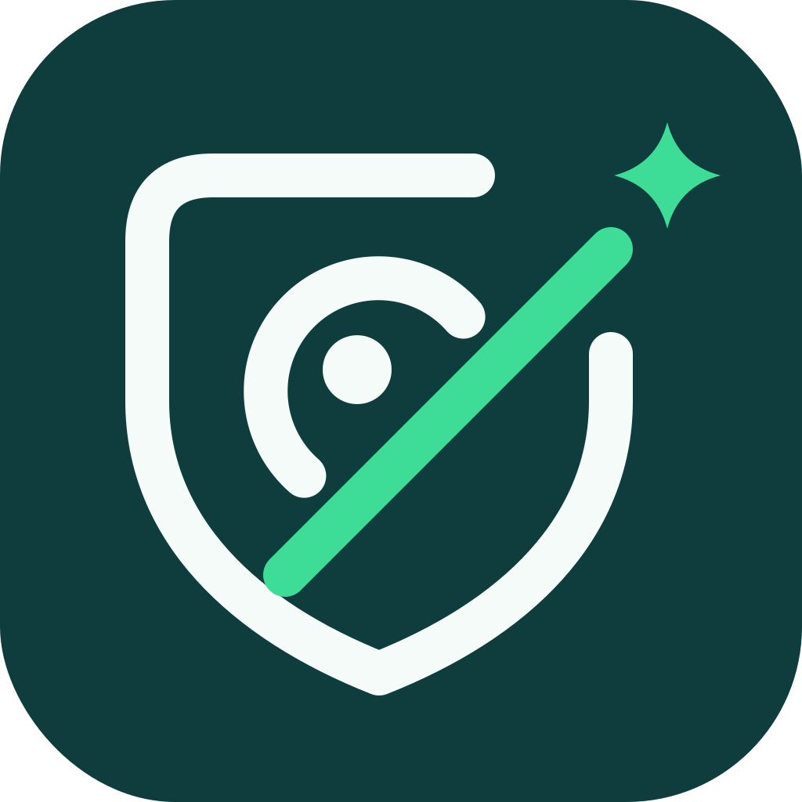

# JiuJing 揪鏡



> 免費、開源、可信任的公益反偷拍工具
> A free, open-source, trustworthy anti-hidden-camera tool — built as a public good.

[](LICENSE)
[]()
[](https://github.com/JiuJingLab/Code-of-Conduct)

**不應該只有偷拍工具。這世界也應該有免費、可信任的公益反偷拍工具。**

---

## 名稱由來

**揪鏡 JiuJing**：還給使用者一個乾淨、無偷拍、私密的安全空間。

維護團隊：**JiuJing Lab 揪鏡實驗室**

---

## 為什麼做揪鏡

### 1. 偷拍已經不是個案

2026 年 5 月起，台灣醫美診所針孔偷拍事件接連爆發。截至 5 月 28 日，衛福部稽查 1,090 家醫療機構，累計 41 家違規遭罰（多數處 50 萬元罰鍰並停業 6 個月）；受害者自救會人數超過千人，其中包含未成年人。攝影機被藏在天花板的「煙霧偵測器」裡——一般人根本無從辨識。

### 2. 反偷拍工具應該是公共財

保護自己不被偷拍，不該是付費才能擁有的能力。揪鏡**永久免費**。

### 3. 偵測資料留在手機

v0.2 的區網／BLE 規則比對與相機輔助都在手機端執行。沒有帳號、伺服器或分析 SDK，不上傳掃描結果與相機畫面。程式碼與限制公開，讓使用者可以查證資料處理方式。

### 4. 開源，才能跟上偷拍的速度

用資安攻防來比喻：**偷拍是紅隊，反偷拍是藍隊。** 紅隊的技術不斷推陳出新，也會研究藍隊的防禦手法。藍隊如果不能快速迭代，防禦就失去意義。

---

## 為什麼開源

1. **專案不依賴特定人**：即使核心成員暫時不在，社群仍能讓專案正常運作。
2. **跟上紅隊的節奏**：社群定期舉辦技術研究讀書會，追蹤新型偷拍手法、討論防禦策略，持續提升產品的防禦能力。

**我們不怕被抄，也不太怕被紅隊研究。** 公益產品開源行之有年。比起防禦手法被看見，我們更怕的是閉門造車、技術遠遠落後。開源社群的多人關注與討論，正是解決這個問題的方法。

---

## v0.2 實作範圍

開發分支：[v0.2](https://github.com/JiuJingLab/ios/tree/v0.2)，版本 `0.2.0`，build `2`。TestFlight 狀態以[發佈紀錄](docs/testflight.md)為準。

- SwiftUI 原生介面，iPhone／iPad、iOS 16+；沿用核定的 JiuJing 揪鏡 Logo。
- **更清楚的掃描結果**：頂部大型狀態卡、待確認／總紀錄數、警示圖示、醒目外框、命中原因、直接查看待確認線索；支援深色模式與 VoiceOver 提醒。
- 明確區分尚未開始、掃描中、已完成、部分結果與失敗。中途停止、逾時、網段受限或權限失敗不會被呈現成「本輪未發現可疑線索」。
- 區網：TCP 80、443、554、8554、8000、8080；Bonjour `_rtsp._tcp`、`_http._tcp`、`_axis-video._tcp`。
- BLE：20 秒被動廣播探索、名稱規則、RSSI、去重；不連線、不配對。等待藍牙超過 15 秒會提示重試。
- **相機輔助檢查**：使用者手動啟動的本機即時預覽、最高 4× 放大（依鏡頭能力）、補光及前後鏡頭切換。沒有拍照、錄影、儲存、上傳或自動 AI 判定。
- **紅外線檢查指引**：說明如何用一般電視遙控器初步觀察鏡頭反應及其限制；不是紅外線感測器，也不保證看見夜視光源。
- 無帳號、廣告、分析 SDK、伺服器、使用額度。掃描結果只在記憶體；進背景停止掃描與相機。
- 規則隨 App 提供；缺少或損毀時停止掃描並顯示錯誤。

**偵測限制：**線索不能確認或排除攝影機。一般 HTTP 服務、藍牙名稱與訊號強度都不是偷拍證據。本版未取得周邊 MAC/OUI，不猜測廠商。區網限 IPv4；大於 /24 的網路只檢查手機所在 /24（標示部分結果），最多 255 個其他位址、40 條並行連線、每個端口 0.85 秒逾時，整輪上限 60 秒。Bonjour 和 IP 紀錄可能屬於同一設備。BLE 最多保留 500 個裝置。離線攝影機、Wi-Fi 隔離、未廣播設備、VPN、防火牆與逾時均可能造成遺漏。模擬器不能驗證真實相機、BLE 或 iOS 本機網路權限。

## 兩小時內功能評估

| 項目 | v0.2 決定與實作 | 後續條件 |
|---|---|---|
| MAC 位址名單比對 | 暫緩；沒有可靠的周邊 MAC 資料來源，BLE UUID 不能當 MAC | 驗證合法公開 API／權限及可用資料，再建立有來源與誤判說明的名單 |
| WiFi | 改善現有同網路服務探索、掃描範圍、完成／受限／失敗提示 | iOS 沒有一般用途的周邊 SSID 掃描 API；不將同網路服務探索說成所有 Wi-Fi 掃描 |
| 紅外線 | 提供人工檢查指引及鏡頭切換 | 不同鏡頭濾光能力不同；需受控光源與硬體實驗才能評估效果 |
| 即時視覺 | 本機相機預覽、放大、補光及人工檢查 | 自動辨識須先準備資料集、標註與誤判評估；本版不宣稱 AI 偵測 |
| 音訊 | 暫緩，不要求麥克風權限 | 環境聲量不能可靠判斷偷拍設備；須先證明可重現的特徵與精確率 |

設計參考 [Fing 的總覽狀態設計](https://help.fing.com/hc/en-us/articles/6348664131730-Network-Security-Rating)與 [Apple Feedback HIG](https://developer.apple.com/design/human-interface-guidelines/feedback)，使用文字、數量、圖示及顏色共同表達狀態，不提供虛構的安全分數。API 依據：[Apple TN3111](https://developer.apple.com/documentation/technotes/tn3111-ios-wifi-api-overview)、[AVFoundation capture session](https://developer.apple.com/documentation/avfoundation/setting-up-a-capture-session)。

以下雲端、AI 影像／音訊、帳號額度及認證內容是未來研究方向，**不是 v0.2 已提供的功能或已取得的認證**。是否需要伺服器，須由模型、裝置效能與隱私評估決定。

---

## 資料與資安

### 設計原則

- **最小化蒐集**：只上傳偵測必要的資料，能在手機端處理的就不上傳。
- **用完即刪**：偵測完成後不保留原始影像/音訊（保存期限將於隱私政策明訂）。
- **不做其他用途**：資料不用於廣告、不販售、不提供第三方。
- **公開可查**：資料流向寫在程式碼裡，任何人都能檢驗。

### 雲端與分工

未來雲端功能可能部署於三大雲端之一（Google Cloud / AWS / Microsoft Azure，評估中）。

雲端採**責任共擔模型**：

- **雲端供應商負責**：機房實體安全、硬體、網路基礎設施，以及平台本身的資安認證。
- **揪鏡團隊負責**：應用程式、存取權限、加密設定、資料保存與刪除政策。

換句話說，選擇三大雲讓我們站在成熟的資安基礎上，但**應用層的資安仍是我們的責任**。我們規劃讓專案取得 **ISO/IEC 27001** 等資訊安全認證。

### 公信力

使用者最終會選擇自己信任的組織。揪鏡由台灣團隊開發，我們正在尋求**婦女團體及其他具公信力的公益組織**合作背書，讓這個公益產品能被信任。

---

## 營運模式

- **完全不收費**
- **開放贊助**支持伺服器成本（GCP / AWS 等）
- **合理使用額度**：為控制成本，若未來加入帳號與雲端服務，可能設定每月使用次數上限。有特殊需求（如需要頻繁檢測的個人或機構）者，歡迎來信說明，我們會個別開放。

### 長期目標

我們希望揪鏡未來能**完整移交給公益團體營運**：由公益團體承擔營運成本，JiuJing Lab 持續協助維護技術，讓專案能被長期支持、穩定運行。

---

## 快速開始

```bash
git clone https://github.com/JiuJingLab/ios.git
cd ios
```

需求：Xcode 26+（本次驗證版本 26.6）、iOS 16+。已提交 `JiuJing.xcodeproj`，可直接開啟；只有變更專案設定時才需要 XcodeGen 2.45+。

```bash
open JiuJing.xcodeproj
# 選擇 JiuJing scheme；實機執行時在 Signing & Capabilities 選擇自己的 Team。
xcodebuild -project JiuJing.xcodeproj -scheme JiuJing -destination 'platform=iOS Simulator,name=iPhone 17 Pro' test CODE_SIGNING_ALLOWED=NO
```

若修改 `project.yml`，執行 `xcodegen generate` 重新產生專案；Team 與 Bundle ID 可在建置時覆寫，請勿提交私鑰或憑證。

- [實機驗收清單](docs/device-validation.md)
- [TestFlight 發佈與審查資料](docs/testflight.md)
- [v0.2 隱私政策](docs/privacy.md)

---

## 參與貢獻

品牌圖檔與 App 圖示的更新方式見 [Logo 素材說明](docs/brand/README.md)。

歡迎任何形式的參與：

- **補充偷拍裝置資料**：編輯 `JiuJing/Resources/known_cameras.json`，新增名稱關鍵字或端口規則，並附上來源與誤判風險
- **實作偵測功能**：參與上方表格中尚待研究的項目
- **加入技術讀書會**：一起研究新型偷拍手法與防禦策略
- **回報誤判**：開 Issue 附上掃描截圖（請隱去個人資訊）
- **翻譯**：英文、日文、韓文

參與前請先閱讀 [社群行為準則](https://github.com/JiuJingLab/Code-of-Conduct) 與 [專案治理](https://github.com/JiuJingLab/Governance)。

---

## 法律聲明

- 本工具僅供在**自己有權使用的空間**（住家、租屋處、旅宿、診間、更衣室等）自我保護使用。
- 請勿掃描他人擁有的網路。
- 偵測結果**僅供參考**，無法保證 100% 偵測，亦不構成法律證據。**發現可疑裝置請立即報警（110）。**

---

## 授權

[MIT License](LICENSE) © JiuJing Lab 揪鏡實驗室

---

**Made in Taiwan 🇹🇼 · 還給每個人一片揪鏡**
